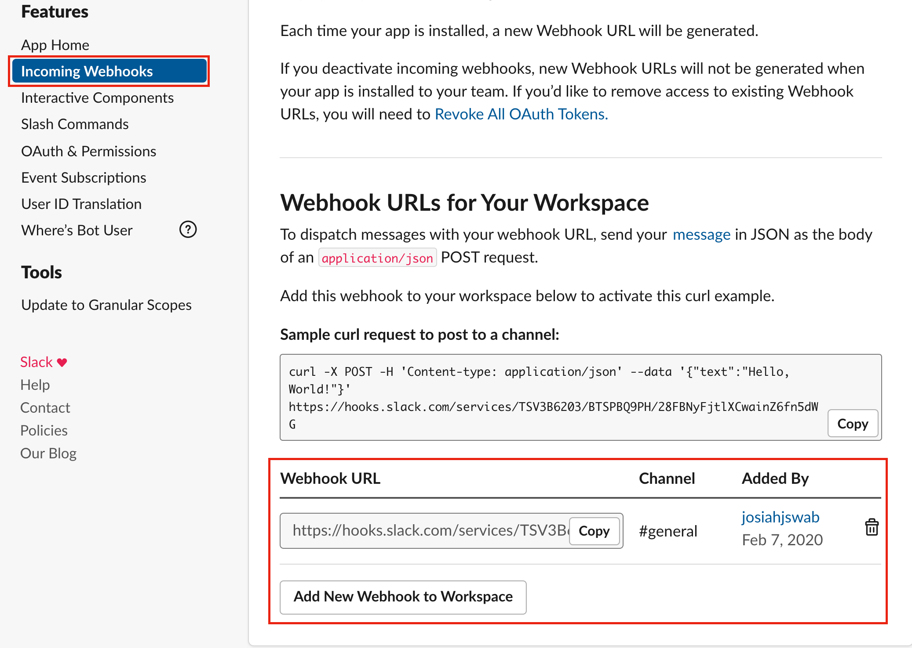

# SDCS Slack Bot 

This Slack bot allows a student to ring the doorbell to alert the staff to open the door and gives them the ability to click a button to let the staff know they got in. A student will also be able to check in and out of class. The check in and out times will be logged for each student. A student will be able to submit a daily stand up report. Staff can view all submitted stand ups for the day in a private channel. Staff can also view summary data for standups and attendance on a dashboard site.

## Table Of Contents
-[Setup](#setup)<br/>
-[Create Tunnel](#create-tunnel)<br/>
-[Create Bot](#create-bot)<br/>
-[Student Dash](#student-dash)<br/>
-[Explorer](#explorer)<br/>
-[Google Authorization](#auth-google)<br/>
-[Google Setup](#setup-google)<br/>
-[Cypress Testing](#cypress)<br/>
-[Slack Blast - Cronjob](#cronjob)<br/>

<a name="setup">

## Setup
Hey the setup can be a bear but hang in there you'll get it!

Install all dependencies:
```
$ npm install
```
Add environment variables to a new file named `.env`. The STUDENTS_CHANNEL is where the students make requests from. The KEY_CHANNEL is where the staff is alerted if somebody rings the door. The ADMIN_REPORTS_CHANNEL is where the staff can view the daily standups that have been submitted.
```
OAUTH_ACCESS_TOKEN= <comes from the slack app>
BOT_USER_OAUTH_ACCESS_TOKEN= <comes from the slack app>
SLACK_CLIENT_ID= <comes from the slack app>
SLACK_CLIENT_SECRET= <comes from the slack app>

# Found in slack app options. Used only for the cronjob messages from staff.
SLACK_CRON_HOOK= <slack webhook that allows cronjob to post to a message to slack channel>

# Used by the slack to choose which channel to send messages.
STUDENTS_CHANNEL= <current students channel ID>
KEY_CHANNEL= <key channel ID>
ADMIN_REPORTS_CHANNEL= <admin reports channel ID>

# Your slack workspace url.
SLACK_URL= <base url for Slack Workspace>

# This is your ngrok link make sure it ends with a trailing slash. Needed for testing and developing '/' commands.
BASE_URL= <ngrok tunnel>

# Only use these when working with google oauth. Not necessary to access the admin dash.
GOOGLE_ID=<Required for Google login (authentication)>
GOOGLE_SECRET=<Required for Google login (authentication)>

# Upon booting with an empty database these become the credentials that you log into the admin dash with.
ADMIN_USERNAME= admin
ADMIN_EMAIL= admin@fake.com
ADMIN_PASSWORD= 1234

# This value should be development to use the local slack-bot-dev db which is generated upon boot.
NODE_ENV= development

TEST_USER_ID= <any user ID in knock channel>
TZ="America/Tijuana"

# We didn't use these in development.
EXTERNAL_LOGGING= <truthy - only runs if value is present>
EXTERNAL_LOGGING_URL= <url to send external logs>
EXTERNAL_LOGGING_TOKEN= <token sent in Post body to external logging url>
API_ROOT= <base url for API recieving new user info related to event hook>
X_API_KEY= <API key for above transaction>
X_USER_ID= <user ID for above transaction>
X_BUSINESS_ID= <business ID for above transaction>

# Only used in production.
MONGODB_URI=<mongo database url>
```
<a name="create-tunnel">

### Create Ngrok Tunnel
Ngrok is used to test the slash commands and slack to app interactivity such as cronjob messages.
Every time you restart Ngrok the url changes so we recommend keeping it in a terminal running for the duration of your sprint as it is a hassel to change the url in all the places that require it.
A couple of places you will be putting the ngrok link will be.
    - slack app: interactive components
    - slack app: slash commands
    - slack app: event Subscriptions
    - .env BASE_URL

1.  Install ngrok: https://ngrok.com/

2.  Run ngrok: `./ngrok http 3000`

3.  Copy the https ngrok link that is generated for use.

4.  Start server in a second terminal: `$ npm start`

<a name="create-bot">

### Create a local dev bot for each coder for testing

1.  Create an app at https://api.slack.com/apps?new_classic_app=1
        GOOD UNTIL FEBUARY 21, 2020 AND THEN ALL SCOPES WILL NEED TO BE
        GRANULAR
    - Add a distinct app name
    - Choose workspace to apply bot to.

2.  Go to basic info and copy CLIENT_ID and CLIENT_SECRET to the env. file
        under SLACK_CLIENT_ID and SLACK_CLIENT_SECRET

        1. Create a [developer account](https://console.developers.google.com/apis/dashboard) on Google.

        2. Get your client id and client secret by selecting create credentials and then selecting Oauth Client Id in the dropdown menu (https://console.developers.google.com/apis/credentials).

            - Click other under Application type and a name
            - Click create
            - Copy Your Client ID and Your Client Secret and add them to your .env file

3.  Go to basic info
    - Click on add features and functionality
    - Click bots
    - Add legacy bot user
    - Give it a display name and default username

4.  Go to OAuth & Permissions
    - DO NOT HIT UPDATE SCOPES
    - Add an Oauth Scope
    - Click Admin
    - Add Scope
5.  Go to Interactive Components
    - Turn on
    - Add {localtunnel url}/slack/interactive to the Request URL
    - Save Changes
5.  Go to Slash Commands
    - Click Create New Command
    - Add short description for each
    - ‘Slash Commands’
    Command = /{dev}doorbell : Request URL = {localtunnel url}/slack/doorbell
    Command = /{dev}checkin : Request URL = {localtunnel url}/slack/checkin
    Command = /{dev}checkout : Request URL = {localtunnel url}/slack/checkout
    Command = /{dev}standup : Request URL = {localtunnel url}/slack/standup
    Command = /{dev}wakatime : Request URL = {localtunnel url}/slack/wakatime
    Command = /{dev}edit : Request URL = {localtunnel url}/slack/edit
6.  Invite bot to workplace
    - Go to ‘Basic Information
    - Select ‘Install your app to your workspace’
    - Click ‘Install App to Workspace’ button
    - Confirm identity
7.  Invite bot to current-students, key, and admin-reports channels
    - Go to workplace in the Slack App
    - Click on current-students channel
    - Click on settings (gear icon)
    - Select Apps and click on ‘Add app’
    - Select your bot and click ‘Add’
    - Repeat for key channel and admin-reports channel
    - NOTE: Save student, key, and admin reports channel IDs for environment variables: right click on the channel and open the url (channel ID will be at the end of the url. example: /CTE2GOOQ4)
8.  Go back to OAuths & Permissions and put the Oauth Access Token and the Bot User Oauth Token into the .env file
9.  Go to Event Subscriptions
    - Turn on
    - Start your server (npm run build && npm start)
    - Verify your request url
     {localtunnel url}/slack/events
    - Which in turn processes the event info and disperses via hooks.
    - Subscibe to Bot Events
        'team_join'
    - Save Changes
10. - Create Admin_Username, Admin_Email, Admin_password in .env file.

<a name="student-dash">

## Using the Student User Dashboard

1.  In order to sign in, go to the https://localhost:3000/login
    - Click sign in with Slack
    - It should say something went wrong. Copy the Passed URI:
    - Go to OAuth & Permissions and click Add New Redirect URL
    - Paste in the Passed URI: and click Add
    - DON'T FOGET TO SAVE URLs
    - Go back to the https://localhost:3000/login page and log back in with slack
    - Allow permissions
    - You should be redirected to the slack login proceed to next step
2.  Go to https://localhost:3000/admin/login
    - Sign in with Admin_Username, Admin_Email, Admin_password that was created in the .env file.
    - Click on Add Student
        - Student type: free
        - Student Name: {Your name}
        - Slack ID: {Slack ID is Copy member ID}
            - Go to your slack workspace
            - Click on development slackbot and go to 'Profile & account'
            - Click on three dots to right of 'Edit Profile'
            - Copy member ID
        - Save
    - Click on View Data For and select FREE
        - Click on {Your name}
    - Click Edit Student
        - Toggle student type from Free to Paid and click Save.
        - Repeat above step a few times.
        - Leave on paid
    - Go back to https://localhost:3000/login
        - Click on login with Slack
        - Congratulations You are in!

<a name="partner-dash">

## Login to the Partner Dashboard

!important a student must have the partners email used for slack set in their student object's "partner_email"

1. Star by going to signin at https://localhost:3000/partner/login
    - Click sign in with Slack. _This creates a Rolemapping object which is associated to the slack_id of a student object's partner_email which contains the partner users slack email._

<a name="explorer">

### Using the explorer

- In order to use the explorer the admin needs to be logged in.
    - save ?auth_token=xxxxx
- go to http://localhost3000/explorer/?auth_token=xxxxx

<a name="auth-google">

### Authorizing Google Authenticated Users

1.  Create a new user associated with your Google account:
    - With the site running, click the button to log in using your account on Google and follow the instructions to enter your email and password. You will be redirected back to the login page because Google has authenticated you, and LoopBack has created a user for you, but you are not yet authorized to view the pages.
2.  Grant the new user admin privilege using either `/explorer` or your MongoDB instance
    - If in explorer, log in with the admin credentials you created on server boot and set the access token with the response id.
    - Go to /users, do a GET request, copy the "id" field of the only user(you) that the db should have.
    - Create a new RoleMapping:
        - Go to /RoleMapping
        - POST /Rolemapping
        - principalType: "USER"
        - principalId: \< the user id copied from /users db >
        - roleId: \< not required >
3.  You should now be able to log in to the site with your Google               credentials

<a name="setup-google">

### Setup Google Authentication

1. Create a [developer account](https://console.developers.google.com/apis/dashboard) on Google.
2. Get your client id and client secret by selecting create credentials and then selecting Oauth Client Id in the dropdown menu (https://console.developers.google.com/apis/credentials).
    - Click other under Application type and a name
    - Click create
    - Copy Your Client ID and Your Client Secret and add them to your .env file
3. Google Auth requires the following dependencies: Loopback component passport, passport, passport google auth, and passport oauth2.
4. Create a providers.js in your root folder and paste this in and add your google id and secret to an env file:
module.exports = {
    'google-login': {
    'provider': 'google',
    'module': 'passport-google-oauth',
    'strategy': 'OAuth2Strategy',
    'clientID': process.env.GOOGLE_ID,
    'clientSecret': process.env.GOOGLE_SECRET,
    'callbackURL': '/admin/auth/google/callback',
    'authPath': '/admin/auth/google',
    'callbackPath': '/admin/auth/google/callback',
    'successRedirect': '/admin/auth',
    'failureRedirect': '/admin/login',
    'scope': ['email', 'profile'],
    'failureFlash': true,
  },
};
5. Once you have your routes setup in server and everything is connected to your button, when you go to {localtunnel url}/admin/login for the first time login in with the ADMIN_EMAIL= and the ADMIN_PASSWORD= you create in the .env file.  You're going to get a redirect uri mismatch. Don't freak out. This just means you set it up right and there's just one more step you need to do.
6. Copy the redirect uri that it's telling you is not authorized, go back to OAuth & Permissions, click on Add New Redirect URL add the URI that it said was a mismatch
    - Click on Add
    - Click on Save URLs

<a name="cypress">

## Cypress Testing

Create a file: `cypress.env.json` in the root directory.

It should contain these this object with values from your .env:

```
{
  "ADMIN_EMAIL": "YOUR ENV VALUE",
  "ADMIN_PASSWORD": "YOUR ENV VALUE"
}
```
Start server: `$ npm run build && npm run devstart`
Then: `$ npm run cypress` to run the test.

<a name="cronjob">

## Cronjob Slack Blast

A cron job runs every 5 minutes and will send the first object returned with a timestamp from that moment to 4:59 sec into the future. Cronjob runs a job check every 5 minutes.

To send a slack blast go to the admin dashboard `Slack Blast` Button. Fill in the fields and hit submit.

For the Slack Bot to know which channel to post to we used a webhook from the slack api. A slack webhook is generated from the slack app website. Generate one then copy and paste it into your .env file



`SLACK_CRON_HOOK=TSV3B6203/BTSPBQ9PH/28FBNyFjtlXCwainZ6fn5dWG`

:copyright: 2019 San Diego Code School
